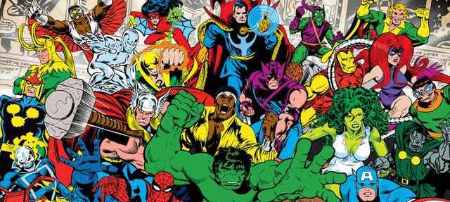

# Project: Visualizing Real World Data

Mar Lizana Atienza

*Data Part Time Barcelona Dic 2019*

## Content

**Índice**   
1. [Project Description](#id1)
2. [Dataset](#id2)
3. [Workflow](#id3)
3. [Results](#id4)

## Project Description

En este projecto nos centraremos en la visualización de un dataset. Para ello usaremos las herramientas vistas en clase, entre las que incluiremos elementos interactivos y gráficos de correlación entre otros.

## Dataset

Hemos seleccionado un dataset de la plataforma Kaggle sobre <a href="https://www.kaggle.com/dannielr/marvel-superheroes/">superhéroes de Marvel</a>. Este conjunto de datos está organizado en diferentes .csv:

* <b>characters.csv</b>. 2 columnas: <CODE>characterID</CODE> y <CODE>name</CODE>.
* <b>charactersToComics.csv</b>. 2 columnas: <CODE>comicID</CODE> y <CODE>characterID</CODE>.
* <b>charcters_stats.csv</b>.  9 columnas: <CODE>Name</CODE>, <CODE>Alignment</CODE>,<CODE>Intelligence</CODE>, <CODE>Strength</CODE>,<CODE>Speed</CODE>, <CODE>Durability</CODE>,<CODE>Power</CODE>, <CODE>Combat</CODE> y <CODE>Total</CODE>.
* <b>comics.csv</b>. 4 columnas: <CODE>comicID</CODE>, <CODE>title</CODE>,<CODE>issueNumber</CODE> y <CODE>description</CODE>.
* <b>marvel_characters_info.csv</b>. 11 columnas: <CODE>ID</CODE>, <CODE>Name</CODE>,<CODE>Alignment</CODE>,<CODE>Gender</CODE>, <CODE>EyeColor</CODE>,<CODE>Race</CODE>,<CODE>HairColor</CODE>, <CODE>Publisher</CODE>,<CODE>SkinColor</CODE>,<CODE>Height</CODE> y <CODE>Weight</CODE>.
* <b>marvel_dc_characters.csv</b>. 4 columnas: <CODE></CODE>, <CODE></CODE>,<CODE></CODE> y <CODE></CODE>.
* <b>superheroes_power_matrix.csv</b>. 4 columnas: <CODE></CODE>, <CODE></CODE>,<CODE></CODE> y <CODE></CODE>.
* <b>marvel_dc_characters-ms</b>. 4 columnas: <CODE></CODE>, <CODE></CODE>,<CODE></CODE> y <CODE></CODE>.

 --> Selección de columnas entre los diferentes csv

## Workflow

--> Crear un csv con la info que nos interesa
--> Estadística
--> Grafo

## Results

